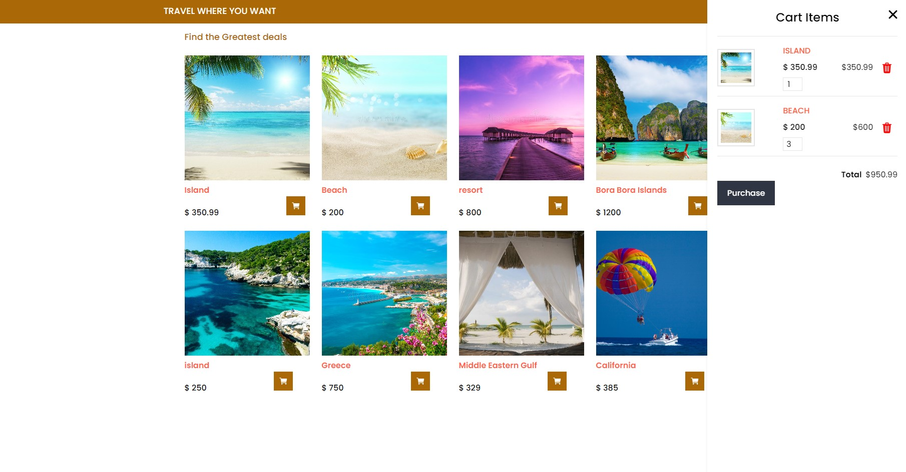

# iTravel
> Website that features a demo of a traveling site, was coded to demostrate certain features more so than what structure shows, basically an HTML front, CSS rendering with JavaScript functionality.

## Table of Contents
* [General Info](#general-information)
* [Technologies Used](#technologies-used)
* [Screenshots](#screenshots)
* [Live Demo](#live-demo)
* [Setup](#setup)

## General Information
- Travel website made to diplay JavaScript functions for adding a booking to a cart
<!-- You don't have to answer all the questions - just the ones relevant to your project. -->

## Technologies Used
- Bootstrap 3
- Babel
- Node.js
- JavaScript
- HTML5
- CSS

## Screenshots

Main Page 

 

Products Page
 

Items To Add
 

Items Added
 

## Live Demo

Click <a href="http://www.adelmor.com/iTravel/public/index.html">here<a> if you would like to see the code in action.

## Setup
after downloading all files in the repo (Visual Studio Code was used to build and run the Web App)
- Open the folder in VS Code then show preview by right clicking on the index file included in the public folder
- Or just click on the on the index icon in the public folder
- and if you would like to see the JavaScript functions after downloading the files head to VS code and open the folder that contains all the files in this repo
- delete package-lock.json file
- open the integrated terminal and run the comman "npm run install --save nodemon"
- after the successful run, run another command "npm run start"
- if it were successful it will display a message and display the localhost followed by a number 
- in a supported browser paste the link from terminal

## Thank you for reading
